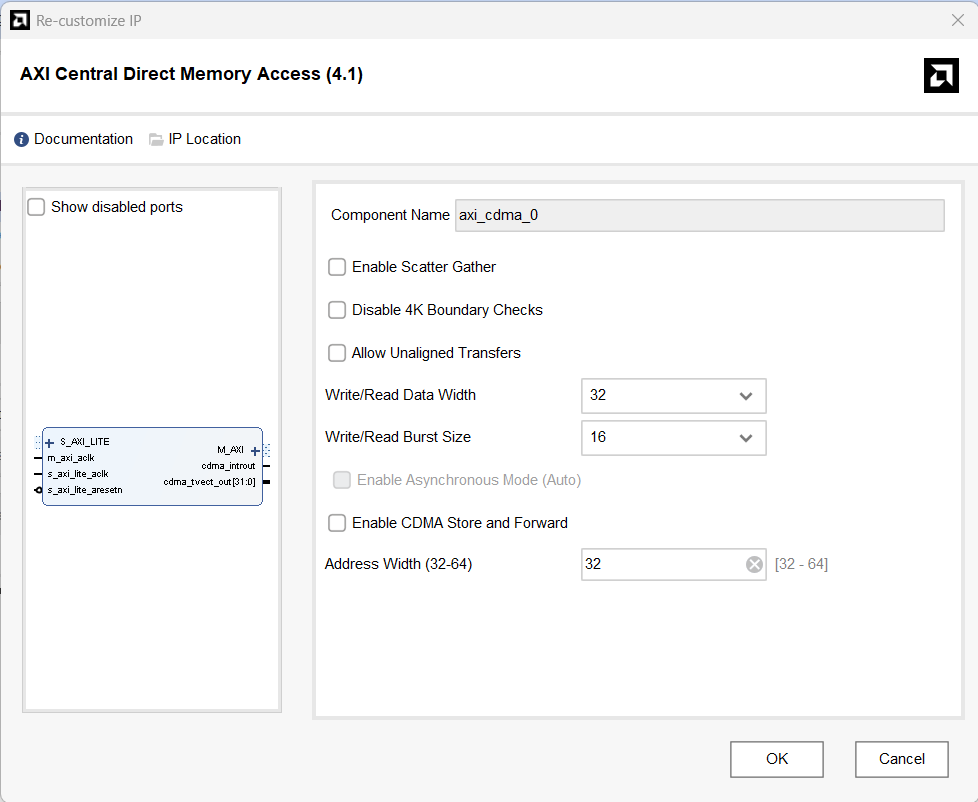
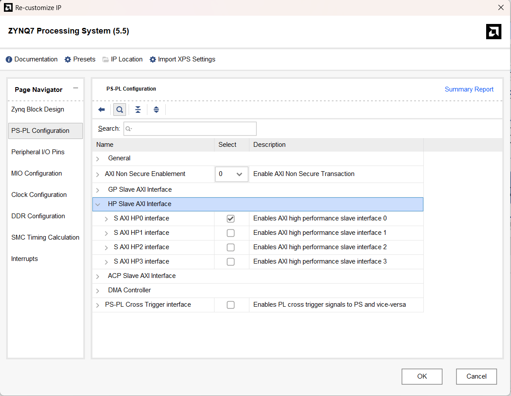
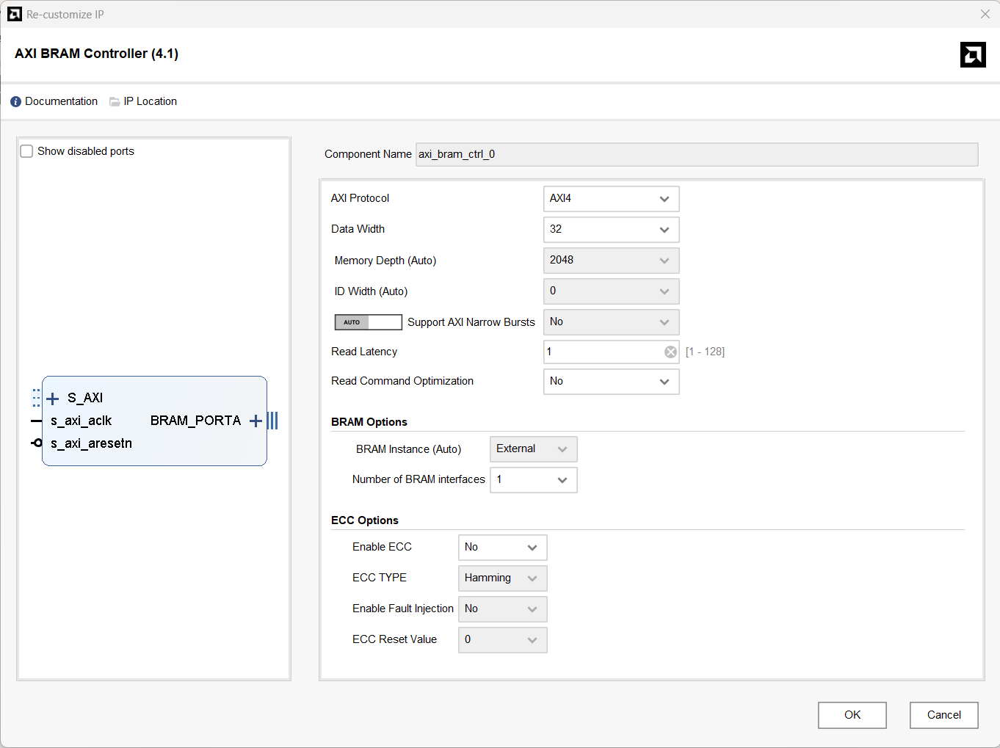
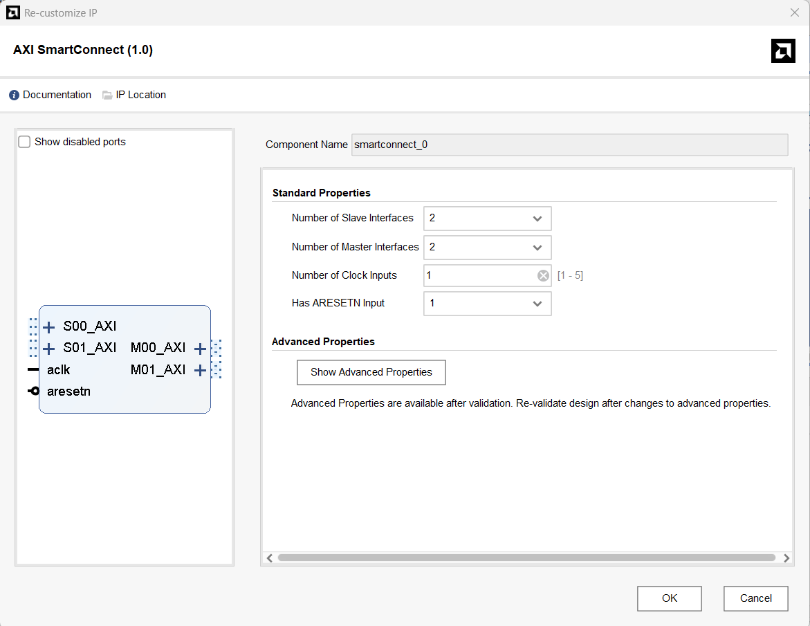
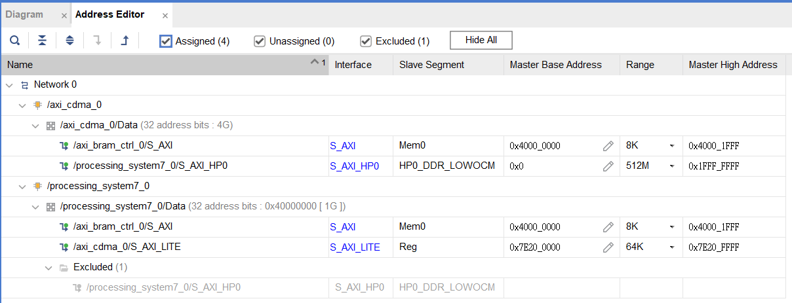
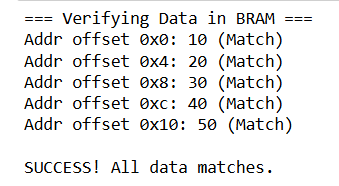

# Part8-CDMA

本章將介紹如何在 PYNQ 上使用 AXI Central Direct Memory Access (CDMA) 模組實現高效能的 Memory-to-Memory 資料搬運，並比較硬體搬運與 CPU 軟體搬運 (memcpy) 的效能差異。

## CDMA Module

AXI CDMA (Central Direct Memory Access) 是一個專門用來在記憶體映射 (Memory-Mapped) 空間之間搬運資料的硬體模組。不同於一般的 DMA (Part 7) 是處理 Stream 介面，CDMA 專注於 Memory to Memory 的傳輸。

### Port Description

CDMA 的介面比一般 DMA 單純，主要分為「控制」與「數據」兩大類：
| 介面名稱 | 方向 | AXI 類型 | 功能描述 |
|---------|------|----------|---------|
| S_AXI_LITE | Slave | AXI4-Lite | 控制介面。連接至 ZYNQ PS 的 GP Port。CPU 透過這個介面讀寫 CDMA 的暫存器 (Registers)，例如設定來源地址、目的地址、搬運長度等。 |
| M_AXI | Master | AXI4 | 數據傳輸介面 (Data Interface)。連接至 ZYNQ PS 的 HP Port (High Performance)。CDMA 透過這個介面直接向 DDR 記憶體發出讀取 (Read) 與寫入 (Write) 請求，不需經過 CPU。 |
| M_AXI_SG | Master | AXI4 | 分散集合介面 (Scatter Gather)。CDMA 透過這個介面從記憶體中讀取「搬運清單」(Descriptors)。它讓 CDMA 能自動執行一連串不連續的搬運任務，而不需要 CPU 介入每一次傳輸。 | 
| cdma_introut | Output | Interrupt | 中斷訊號。當搬運完成或發生錯誤時，可發送中斷通知 CPU 。 |
| m_axi_aclk | Input | CLOCK | 系統時脈。這不是 AXI 匯流排，而是驅動 AXI 匯流排運作的「心跳」。在 Block Design 中，它通常會顯示為一個時鐘圖示的接腳。 |
| s_axi_lite_aclk | Input | CLOCK | 控制介面時脈。在很多 IP 設計中（包含 CDMA），為了簡化，這個接腳常與 m_axi_aclk 內部短路或共用，通常接同一個來源即可。 |
| s_axi_lite_aresetn| Input | RESET | 系統重置 (Active Low)。這是一個標準的重置介面。`n` 代表 Negative Logic (低電位動作)，也就是給 `0` 時會重置，給 `1` 時正常工作。 |

### Settings

- Enable Scatter Gather:

  - Unchecked: 使用 Simple Mode。這是最單純的模式，CPU 每次給一個來源、一個目的、一個長度，CDMA 就搬一次。適合大區塊資料搬運。

  - Checked: 使用 Scatter-Gather (SG) Mode。適合搬運分散在記憶體不同位置的破碎資料 (Linked List)，控制較複雜。

- Write/Read Data Width:

  - 設定資料匯流排的寬度 (例如 64-bit 或 32-bit)。

  - 建議配合 Zynq HP Port 的設定 (通常設為 64 或 32)，寬度越寬，單次 Clock 搬運的資料量越大，頻寬越高。

- Write/Read Burst Size:

  - 決定一次 AXI 傳輸突發 (Burst) 的長度。數值越大 (如 16, 32, 64)，匯流排利用率通常越高。

## Part 8.1 Block Design

1. Create a new Vivado Project and Create a new Block Design
   
2. 加入`ZYNQ7 Processing System`，點`Run Block Automation`
   
3. 設定`ZYNQ7 Processing System`，點`PS-PL Configuration`，打開`HP Slave AXI Interface`，勾選 `S AXI HP0 interface`
   

4. 加入`AXI Central Direct Memory Access`，在設定中取消勾選`Enable Scatter Gather`
   

5. 加入`AXI BRAM Controller`，將`Number of BRAM Interfaces`設為`1`
   

6. 加入`Block Memory Generator`
   
7. 加入2個`AXI SmartConnect`，把`Number of Master Interfaces`設為2

8. 手動接線
    - Zynq M_AXI_GP0 -> AXI SmartConnect (1號) 的 S00_AXI
    - AXI SmartConnect (1號) 的 M00_AXI -> CDMA 的 S_AXI_LITE
    - AXI SmartConnect (1號) 的 M01_AXI -> AXI SmartConnect (2號)的S01_AXI
    - CDMA M_AXI -> AXI SmartConnect (2號) 的 S00_AXI
    - AXI SmartConnect (2號) 的 M00_AXI -> Zynq 的 S_AXI_HP0
    - AXI SmartConnect (2號) 的 M01_AXI -> BRAM Controller 的 S_AXI
    - BRAM Controller 的 BRAM_PORTA -> Block Memory Generator 的 BRAM_PORTA。

9. 接完後按`Run Connection Automation`，結果如下圖
   

10. 在`Address Editor`按下`Assign All`後結果如下圖

11. 執行`example.ipynb`，若最終輸出`SUCCESS! All data matches.` 即代表結果正確

